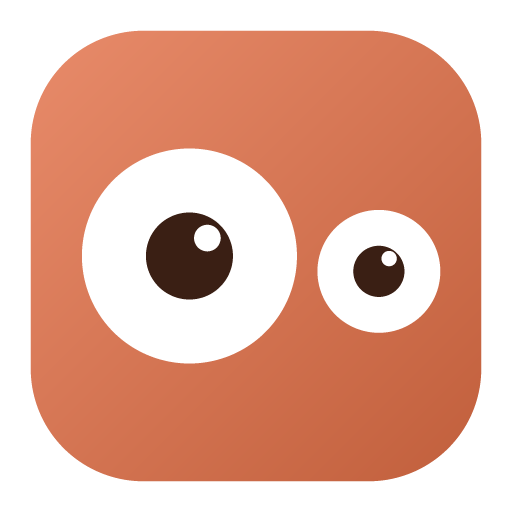
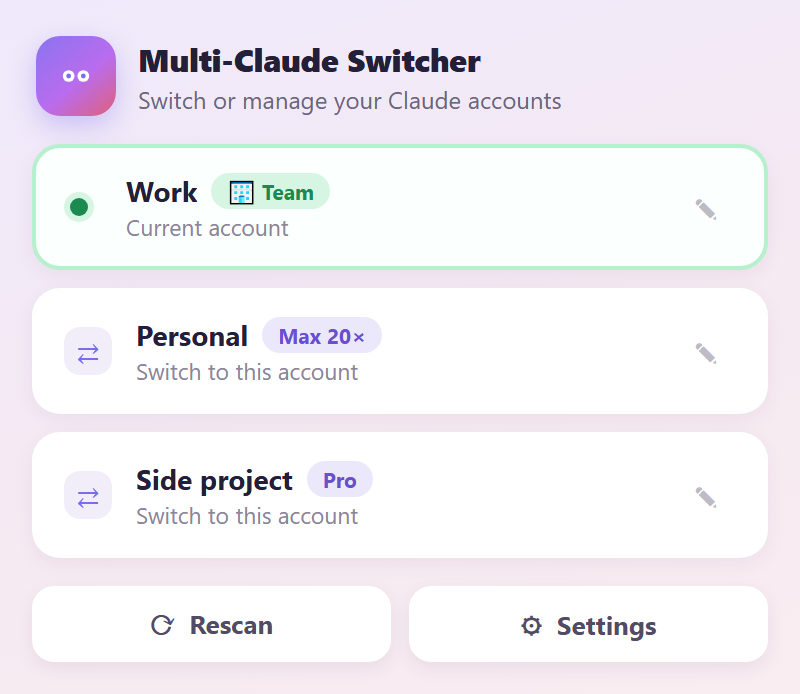

# Multi-Claude Switcher



在同一台電腦上切換多個 Claude Desktop 帳號。免登出、免重打密碼，每個帳號的 Claude Code 對話紀錄各自保留。

[](https://github.com/miou1107/multi-claude-switcher/releases/latest)
[](LICENSE)
&nbsp; [English](README.md) | **繁體中文**

---

## 為什麼你需要這個工具？

通常 Claude Desktop 一次只支援使用一個帳號，所以在這兩種情況下你會特別痛：

- **額度用盡**：A 帳號額度用完了，想換 B 帳號繼續寫 Code。
- **公私分明**：公司的專案和自己個人 Side Project，不想全部都混在同一個帳號中。

如果要手動切換帳號的話，你得要先登出再重新登入另一組帳號，而且等它跑完後會發現 **側邊對話紀錄空了**，
因為那些紀錄是跟著上一個帳號走的。

**這個工具就是來解決這件事的：**

1. **一鍵秒切**：點系統匣的常駐圖示可秒切多帳號。
2. **永遠登入**：每個帳號都各自保持登入狀態，切換時完全不用重新輸入帳密。
3. **紀錄不打架**：各帳號的 Code 對話紀錄原封不動、互不干擾。單純切換完全不會
   動到任何 session 資料。
4. **跨帳號對話紀錄同步**：當然你也可以勾選自動同步(或手動同步)，讓所有帳號的對話紀錄保持一致，方便你跨帳號開發。


---

## 安裝

> ⚠️ **Windows用戶重要提醒**
> 你必須使用**獨立安裝版**的 [Claude Desktop](https://claude.com/download)。
> **Microsoft Store 版不支援**：如果你是從 Microsoft Store 安裝 Claude Code，可能會因其沙盒限制而無法正常使用。
>  建議你從 Claude 下載官方 .exe 獨立安裝版。

**macOS**
> macOS使用者推薦使用 brew 指令安裝，快速又方便!
```bash
brew install --cask miou1107/tap/multi-claude-switcher
```

或是到[最新版本](https://github.com/miou1107/multi-claude-switcher/releases/latest)
下載 `Multi-Claude-Switcher_<版本>_macos.zip`，解壓縮後把
**Multi-Claude Switcher.app** 拖進**應用程式**。

*只有第一次要做。* 目前 app 沒有Apple Developer 公證簽章，所以安裝時可能會被擋。
請開啟macOS的**系統設定 → 隱私權與安全性**往下捲，按**強制打開**就能完成安裝並正常使用。

或者可以直接用終端機指令來強制開啟，就能正常安裝使用：

```bash
xattr -dr com.apple.quarantine "/Applications/Multi-Claude Switcher.app"
```

**Windows**

到[最新版本](https://github.com/miou1107/multi-claude-switcher/releases/latest)
下載 `Multi-Claude-Switcher_<版本>_windows_setup.exe` 執行。它只裝給你這個使用者，
所以不會跳系統管理員權限。裝完從**開始選單**開 **Multi-Claude Switcher**。


**自動更新**

完成安裝後，只要有新版發布，系統便會自動在背景更新到最新版本。

## 怎麼用

安裝完成後，請在 macOS 選單列或 Windows 系統匣上找尋眼睛圖示，
點擊後功能面板就會跳出來。

面板上會顯示你的帳號清單，並標出你現在在用哪個。可隨時切換到不同帳號，切換後 Claude Desktop
會自動重開至你指定的帳號。

**Rescan** 會找出這台機器上曾經登入過的帳號，你可以自行勾選並加入帳號清單中。**Rename** 讓你可
自行取一個好記好懂的名字。**Settings** 裡有自動同步對話紀錄及開機自行啟動兩個開關，並且有手動備份、檢查更新、查看 log 和備份資料夾等額外功能。

按 **Esc** 或點面板外面就關掉。Windows 上再點一次系統匣圖示也會關，對圖示按右鍵有
**Quit**——萬一面板本身開不起來，那是你的逃生門。

## 把對話搬到另一個帳號

切換帳號和對話紀錄同步是兩個不同的功能。**單純切換完全不會動到 session 資料。** 如果你只是要在帳號之間
跳來跳去，不需要讓對話紀錄在兩個帳號間同步，那這一段可以直接跳過。

真的想讓對話跟著你走的話，有兩條路：

**Sync sessions** 是把一個帳號的 Code session 複製到另一個，但不改變你現在用的是哪個
帳號。它會先備份目標端，弄完再把你原本在用的帳號開回來。

**切換時自動同步**預設是關的。打開之後，每次切換都會把兩邊的 session 雙向合併，久了
兩個帳號的紀錄就會一致。第一次打開會警告你一次，因為合併過去的東西，不會因為你把開關
關掉就退回來。

不管走哪條，同步只會**新增**。對方已經有的那筆對話絕對不會被蓋掉，就算送進來的那份看起來
比較新也一樣。兩邊對同一筆對話各有一個版本時，兩份都留著，並且把衝突報給你，而不是自己
默默決定。

這是刻意的。session 檔的時間戳記沒辦法可靠地告訴你哪一份比較好：Claude Desktop 在找不到
某筆對話的內容本體時會重寫那筆紀錄，於是壞掉的那份反而變成比較新的。所以兩份都不丟，
這裡也不去猜。

每次寫入前都會先做一份加時間戳記的快照；快照失敗的話，這次寫入就直接不做。

只有 Code 分頁會同步。一般聊天的對話存在 Anthropic 伺服器上、每個帳號各一份，本機做
什麼都搬不動它。

## Claude Team 方案帳號的對話紀錄只能匯出，不能匯入

你可以把 Code session **從** Claude Team 帳號複製**出來**，但**複製不進去**。因為 Team 帳號
的對話清單是由 Anthropic 雲端控管的，所以無法將其他帳號的對話紀錄直接匯入，目前無解。


[想了解 Claude Team 的限制細節，請參考 →](docs/team-accounts.md)

## 常見問題與救援

**Q：清單上為什麼只看到一個帳號？**
打開面板點 **Rescan**，勾選你要管理的帳號。還沒登入過的帳號也會列出來：先勾選它，
切換過去，再在 Claude Desktop 裡完成登入。

**Q：（Windows）面板打不開怎麼辦？**
通常是你的電腦缺了 WebView2 套件。對系統匣的眼睛圖示按右鍵選 **Quit**，請自行安裝好 WebView2 之後再重開 (理論上 Win10 21H2 版本都有內建)。

**Q：我的對話紀錄亂掉了，救得回來嗎？**
可以。Settings → **Open backup folder**，裡面是按設定檔分開、加了時間戳記的快照。
注意快照**不會自動清理**，太佔空間的話手動刪掉舊的是安全的。

**Q：log 在哪裡？**
Settings → **Open log folder**，或直接找 `~/.multi-claude-switcher/logs/`。

**Q：如何徹底移除？**

- **macOS**：刪掉 app，再清掉 `~/.multi-claude-switcher/` 和
  `~/Library/LaunchAgents/com.miou1107.multi-claude-switcher.plist`。
- **Windows**：從「新增/移除程式」解除安裝，再刪掉 `%USERPROFILE%\.multi-claude-switcher`。

移除本工具完全不會影響你原本的 Claude Desktop 帳號與資料。

---

## 參與開發與授權

[從原始碼建置 →](docs/building.md) ·
[CLI 參考 →](docs/cli.md) ·
[運作原理 →](docs/how-it-works.md)

`FILELIST.md` 說明 repo 裡的每個檔案，`CHANGELOG.md` 是版本紀錄。

授權條款：[MIT](LICENSE)。

**免責聲明**：本專案與 Anthropic 無任何隸屬關係。工具的運作原理只是讓 Claude Desktop
對著不同的本機資料目錄啟動，並在它們之間複製 session 檔案；它不會碰到你的登入憑證，
更不會上傳任何東西。
請自行判斷、斟酌使用本專案程式碼，作者不提供任何承諾與保障，任何風險及後果由使用者自行承擔。
